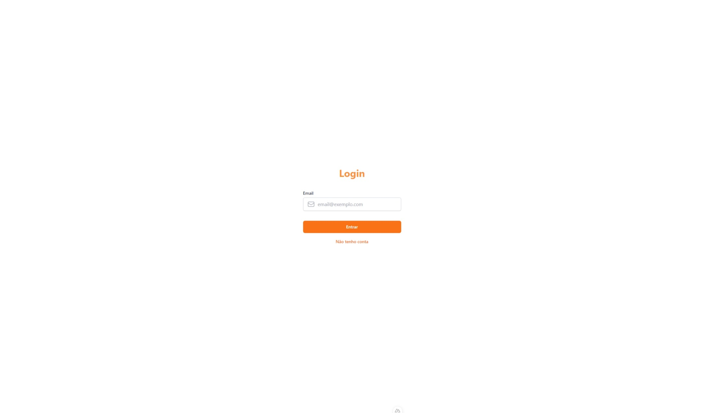
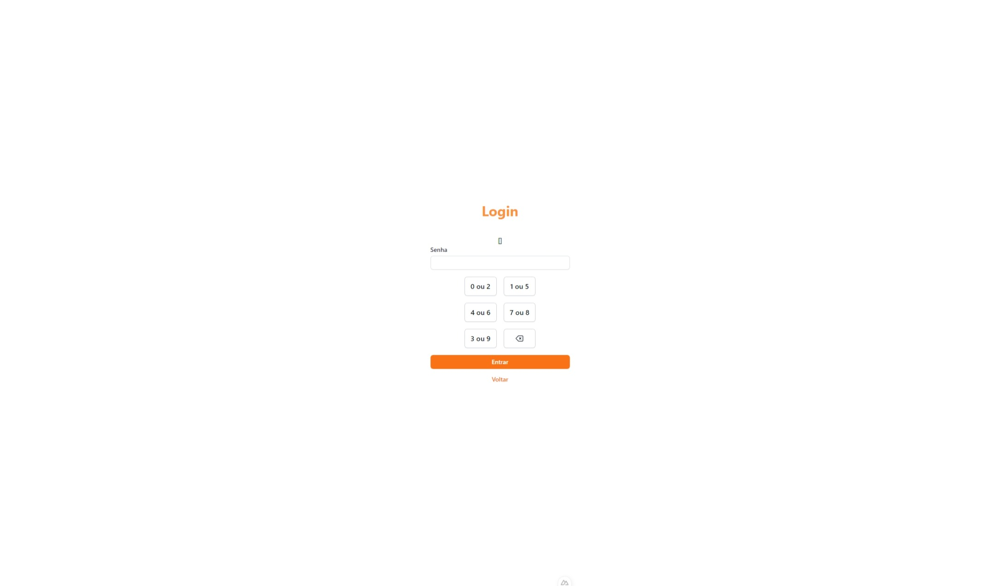

# Bank Login

Projeto simples de um sistema de login de um banco, com o sistema de senha de múltiplos dígitos.
Autenticação feita com o número da conta e senha de 6 dígitos com salvamento usando lowDB.

## Screenshots

